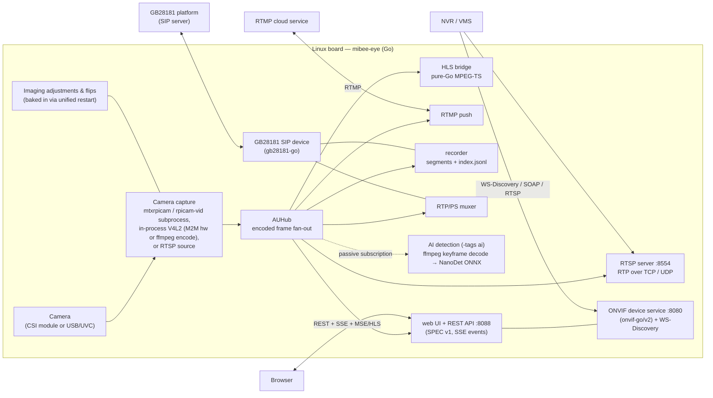
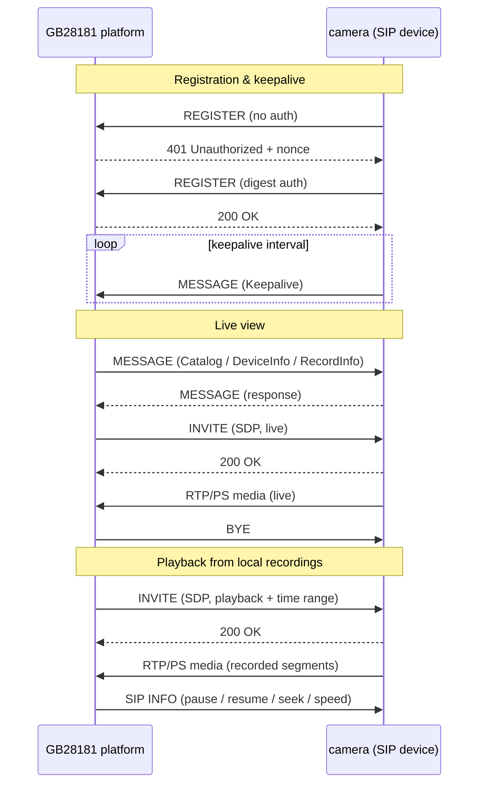

# MiBee Eye (蜂眼)

[](https://github.com/xiqing85/mibee-eye-go/actions/workflows/ci.yml)
[](https://golang.org)
[](LICENSE)

[中文文档](README_zh.md)

<div align="center">
  <table>
    <tr>
      <td align="center"><b>🪶 ~74 MB measured</b><br><sub>RPi 3B, AI build, main process (see benchmark)</sub></td>
      <td align="center"><b>✅ ONVIF Profile S</b><br><sub>Device · Media · Imaging</sub></td>
      <td align="center"><b>🔧 Zero CGO</b><br><sub>Pure Go, painless cross-compile</sub></td>
    </tr>
  </table>
</div>


MiBee Eye is a lightweight Go ONVIF camera service for any Linux board (Pi CSI
cameras via libcamera, USB/UVC via the v4l2 mode). It also runs on any Linux box as a protocol gateway:
with `camera.mode: rtsp` it turns an existing RTSP stream into an
ONVIF/GB28181 device — see [Supported hardware](#supported-hardware). It provides ONVIF Device/Media/Imaging services, RTSP streaming, RTMP push, WS-Discovery, GB28181 device integration, and an embedded SPEC v1 web admin UI — for NVR/VMS integration.

This is the **Go implementation** of MiBee Eye. A sibling [Rust implementation](https://github.com/xiqing85/mibee-eye-rs) targets the most constrained boards — see [Which implementation should I use?](#which-implementation-should-i-use).

**Runs on any Linux board** — three capture profiles: Pi CSI cameras via
libcamera (`mtxrpicam`/`rpicamvid`), any V4L2/USB-UVC camera via the generic
`v4l2` mode (hardware M2M encode when `camera.encoder_device` probes capable,
otherwise a resident ffmpeg subprocess), and `rtsp` mode to re-publish an
external RTSP stream as an ONVIF/GB28181 device from any box.

## Which implementation should I use?

Both implementations speak the same protocols (ONVIF Profile S, GB28181,
RTSP, RTMP), share the same SPEC v1 web UI/API, and interoperate with the same
NVRs — pick by deployment profile:

| Pick the **Go** implementation when… | Pick the **Rust** implementation when… |
|---|---|
| You want the quickest path: zero-CGO build, stock cross-compile | The board is memory/flash constrained (~2 MB binary; see the measured full-load RSS below) |
| You want HLS browser playback out of the box | You want the OSD watermark burned into every output |
| You need the i18n UI or the runtime metrics API | You want capture + encode fully in-process (no capture subprocess) |
| You prefer hacking on a Go codebase | You prefer hacking on a Rust codebase |

Both: AI detection (NanoDet, opt-in) · GB 35114 A-level (opt-in) · continuous
recording with GB28181 playback · imaging controls · snapshot.

## Features

- **ONVIF Device/Media/Imaging Services** - Full ONVIF Profile S compliance for NVR integration, powered by [onvif-go/v2](https://github.com/mickeyzzc/onvif-go)
- **GB28181 Device** - SIP registration, Catalog/DeviceInfo/RecordInfo queries, live/playback/download PS streaming over UDP or TCP, SIP INFO playback control (pause/resume/seek/speed), platform snapshot commands — powered by [gb28181-go](https://github.com/mickeyzzc/gb28181-go)
- **GB 35114 A-level** - Optional SM2 certificate REGISTER auth + keyed-SM3 integrity (`-tags gb35114`)
- **RTSP Streaming** - H.264 video streaming (RTP over TCP interleaved or UDP) at configurable resolutions and bitrates
- **RTMP Push** - Stream to cloud services like Aliyun, Twitch, YouTube
- **WS-Discovery** - Automatic camera discovery on the network
- **Local Recording** - Continuous H.264 segments with `index.jsonl`, retention days and storage cap; feeds GB28181 playback
- **Web Admin UI** - Embedded SPEC v1 admin panel: cookie-session + CSRF auth, live preview (MSE/HLS), config API, SSE events
- **AI Detection** - NanoDet-Plus ONNX object detection on keyframes (`-tags ai`), see [AI detection](#ai-detection-optional) below
- **Camera Controls** - Brightness, contrast, saturation, sharpness, white balance, exposure mode; horizontal/vertical flips baked into the stream via a unified restart flow
- **HLS Live Streaming** - Pure Go MPEG-TS segmenter for browser playback (no ffmpeg)
- **i18n Support** - English/Chinese web UI
- **Snapshot Support** - JPEG snapshots via HTTP endpoint
- **Metrics** - Runtime metrics summary over the web API
- **Low Memory Footprint** - ~15–25 MB in lean configs; ~74 MB measured on RPi 3B with the AI build (main process — the rpicam-vid/ffmpeg capture subprocesses are extra)
- **Cross-Platform Build** - Compile from x86 workstation to aarch64 RPi

```bash
# Clone and build
git clone https://github.com/xiqing85/mibee-eye-go
cd mibee-eye-go
make build

# Copy and configure
cp configs/config.example.yaml config.yaml
# Edit config.yaml for your camera and network

# Run directly
./build/mibee-eye -config config.yaml

# Or deploy with systemd
sudo cp deploy/mibee-eye.service /etc/systemd/system/
sudo systemctl daemon-reload
sudo systemctl enable --now mibee-eye
```

Prebuilt binaries for Linux (amd64 / arm64 / armv7) are available on the
[Releases](https://github.com/xiqing85/mibee-eye-go/releases) page.

## Configuration

See `configs/config.example.yaml` for all configuration options. Key settings include:

- `camera.mode` - Capture mode: `mtxrpicam` (Pi CSI subprocess pipe), `rpicamvid` (system rpicam-vid), `rtsp` (pull from an RTSP source), or `v4l2` (generic V4L2 capture — any board, USB/UVC included)
- `camera.encoder_device` - V4L2 M2M encoder node probed in `v4l2` mode (default `/dev/video11`, bcm2835-codec-encode; falls back to an ffmpeg subprocess when absent or not M2M-capable)
- `camera.width/height` - Capture resolution (1280x720 default)
- `camera.fps` - Frames per second (15 default for SBCs)
- `camera.bitrate` - Video bitrate in bits per second
- `camera.idr_period` - Keyframe interval; also bounds the AI detection cadence
- `camera.hflip` / `camera.vflip` - Flips baked into the stream (applied via unified restart)
- `camera.rotation` - Quarter-turn rotation (0/90/180/270° clockwise) baked into the stream; 90/270 swap the announced resolution (v4l2 mode, in-process transpose; rpicamvid mode 0/180 only — Pi libcamera has no transpose support; other modes reject non-zero)
- `rtsp.port` - RTSP streaming port (8554 default)
- `onvif.port` - ONVIF HTTP/SOAP port (8080 default)
- `onvif.username/password` - ONVIF authentication credentials
- `onvif.events_enabled` - Pull-Point events service: AI motion alarms as MotionAlarm for NVR subscribers (default: true)
- `web.enabled` - Enable Web admin UI (default: true)
- `web.port` - Web UI HTTP port (8088 default)
- `gb28181.enabled` - Register with a SIP platform (default: false)
- `gb28181.transport` - SIP transport: `udp` or `tcp` (default: udp)
- `recording.enabled` - Continuous local recording (default: false)
- `recording.storage_path/segment_secs/retention_days/max_storage_mb` - Recording layout and pruning (default: `recordings` / 600 / 3 / 8192)
- `ai.enabled` - NanoDet detection (default: false; requires a `-tags ai` build)
- `metrics.*` - Runtime metrics collection

Environment variables override any config setting with `MIBEE_EYE_` prefix:
```bash
MIBEE_EYE_ONVIF_PASSWORD=secret ./build/mibee-eye
```

## Deployment

Create a systemd service unit based on `deploy/mibee-eye.service`. Customize for your environment:

```bash
# Install and configure
sudo cp deploy/mibee-eye.service /etc/systemd/system/
# Edit paths and user for your setup
sudo systemctl daemon-reload
sudo systemctl enable --now mibee-eye
```

## Web Admin UI

The built-in web admin panel follows the SPEC v1 API shared across the MiBee camera projects: JSON envelope `{"ok":true,"data":…}` / `{"ok":false,"error","message"}`, cookie-session login with double-submit CSRF, capability negotiation, and an SSE event channel.

- **Live Preview** - MSE (Media Source Extensions) and HLS (hls.js) players for flexible browser playback
- **Imaging Controls** - Sliders for brightness, contrast, saturation, sharpness; white balance and exposure mode dropdowns; flip toggles with save-and-restart
- **Config API** - `GET/PUT /api/config` with partial-merge semantics (absent sections untouched)
- **Camera & Detections** - `GET /api/cameras`, `GET /api/detections` (AI builds), SSE `GET /api/events`
- **Metrics** - `GET /api/metrics/summary`
- **Snapshot Button** - One-click JPEG capture (`GET /snapshot`)

Access at `http://<device-ip>:8088/` with web UI credentials. Web UI defaults reuse ONVIF credentials. The Web UI is embedded in the binary via `//go:embed` — no additional files to deploy.

## Supported Hardware

Three capture profiles cover Pi CSI modules, generic V4L2 devices and
existing IP cameras:

| Capture mode | Works on | Encoding |
|--------------|----------|----------|
| `mtxrpicam` / `rpicamvid` | Raspberry Pi family (CSI module) | H.264 from the libcamera front end (subprocess) |
| `v4l2` | any Linux board — USB/UVC included | in-process V4L2 M2M hardware when `camera.encoder_device` probes capable, otherwise a resident ffmpeg subprocess |
| `rtsp` | any host with an existing IP camera | re-publishes the source stream (no re-encode) |

### Camera Modules (Pi CSI)

| Module | Sensor | Resolution | Focus | DT Overlay | Notes |
|--------|--------|------------|-------|------------|-------|
| Pi Camera V1 | OV5647 | 2592×1944 | Fixed | `ov5647` | Current setup |
| Pi Camera V2 | IMX219 | 3280×2464 | Fixed | `imx219` | Better low light |
| Pi Camera V3 | IMX708 | 4608×2592 | Autofocus | `imx708` | PDAF, HDR support |
| Pi HQ Camera | IMX477 | 4056×3040 | Manual lens | `imx477` | Interchangeable lens |
| USB (UVC) | Various | Various | Fixed | `uvcvideo` | Direct capture in `camera.mode: v4l2` (any board); ffmpeg fallback encoder needs ffmpeg installed |

## Architecture



On a Raspberry Pi, capture uses a battle-tested libcamera front end
(`mtxrpicam` subprocess pipe, or the system `rpicam-vid`), so the service
itself stays pure Go with zero CGO. The generic `v4l2` mode captures
in-process (pure-Go V4L2: M2M hardware encode when the probed node is
capable, otherwise a resident ffmpeg subprocess), and `rtsp` mode re-publishes
an external stream without re-encoding. Every subscriber taps the same
encoded frame hub (AUHub) — including the AI detector, which subscribes
passively and never interferes with capture or streaming. ONVIF/GB28181
protocol logic lives in the extracted libraries
[onvif-go/v2](https://github.com/mickeyzzc/onvif-go) and
[gb28181-go](https://github.com/mickeyzzc/gb28181-go).

### GB28181 interaction overview



### vs running MediaMTX on the Pi as a camera source

MediaMTX is an excellent media *server* (NVR/relay side) — and it is itself a
pure-Go, zero-CGO project. The comparison below is only about the camera-side
role: turning a Pi + CSI camera into an ONVIF/GB28181 device an NVR can
discover and pull from.

| Camera-side capability | MiBee Eye | MediaMTX |
|------------------------|-----------|----------|
| ONVIF device service (Profile S) | ✅ Device/Media/Imaging | ❌ (not its role) |
| GB28181 device | ✅ | ❌ |
| Camera imaging controls | ✅ Brightness/contrast/WB/… | ❌ |
| RTMP push | ✅ built-in | ⚠️ possible, media-server style |
| Memory (RPi 3B, 720p@15fps) | **~74 MB measured** (AI build, main process) | **~93 MB measured** (full feature set) |

Measured 2026-09-17 with [`bench/rpi-bench.sh`](bench/rpi-bench.sh): Go on
`rpi3b-cam` (RPi 3B, IMX219 1280×720@15, AI build, `rpicamvid` capture,
GB28181 registered, one RTSP/TCP client, 60 s): RSS 71–79 MB (avg 74), CPU
179–278% — main process only, the rpicam-vid/ffmpeg capture subprocesses are
extra; lean non-AI configs sit far lower. Rust sibling on `rpi3b-storage`
(RPi 3B, OV5647, full feature set, in-process pipeline): RSS ~93 MB, CPU
~1.4 cores — see its README for details. Reproduce on your own board.

### Technology Stack

| Component | Library | Rationale |
|-----------|---------|-----------|
| ONVIF Server | [onvif-go/v2](https://github.com/mickeyzzc/onvif-go) | Extracted protocol library, pure Go |
| GB28181 Device | [gb28181-go/device](https://github.com/mickeyzzc/gb28181-go) | Extracted protocol library, pure Go |
| RTSP Server | `bluenviron/gortsplib/v5` | Same as MediaMTX, proven compatibility |
| RTMP Push | Pure Go implementation | Active maintenance, low footprint |
| Camera Capture | `mtxrpicam` / `rpicam-vid` subprocess, or in-process V4L2 | Battle-tested libcamera on Pi; pure-Go V4L2 (M2M hw + ffmpeg fallback) elsewhere |
| HLS Bridge | Pure Go MPEG-TS segmenter | No external dependencies, lightweight |
| AI Detection | `onnxruntime_go` + ffmpeg keyframe decode | Dynamic ONNX runtime loading, keyframe-only cadence |
| Web UI | Embedded zero-build ES modules UI + hls.js | Capability-gated rendering, no external deps |
| Configuration | YAML | Human-readable, easy deployment |

Built with pure Go — **zero CGO** in the default build. All protocols (ONVIF, GB28181, RTSP, RTMP, HLS, Snapshot) are implemented in pure Go; the only exception is the optional AI build tag, which links CGO against ONNX Runtime.

## AI Detection (optional)

Build with `-tags ai` to enable NanoDet-Plus object detection on keyframes:

```bash
# Cross-compile with AI (CGO: requires an aarch64 cross gcc, e.g. Arm GNU Toolchain)
CGO_ENABLED=1 CC=aarch64-none-linux-gnu-gcc GOOS=linux GOARCH=arm64 \
  go build -tags ai -o build/mibee-eye-ai ./cmd/server
```

At runtime the detector decodes H.264 keyframes to RGB via an `ffmpeg`
subprocess, runs the bundled NanoDet-Plus-m 320 ONNX model through
ONNX Runtime, and exposes results via `GET /api/detections` and the
`ai_detection` SSE event. The effective detection cadence is bounded by
`ai.interval_ms` **and** the camera keyframe interval (`camera.idr_period`).
Missing model or runtime library degrades to `ai:false` capability — never
fabricated detections.

## Development

```bash
# Build on workstation
make build

# Cross-compile for aarch64 SBCs
make build GOOS=linux GOARCH=arm64

# Run tests
make test

# Deploy to remote
make deploy REMOTE_HOST=user@your-rpi-host
```

## License

Licensed under the **Apache License, Version 2.0** — see [LICENSE](LICENSE).
MediaMTX-derived portions (internal/camera) remain MIT; see [NOTICE](NOTICE).

> Licensing history: v0.1.0 shipped under CC BY-NC 4.0; the project
> relicensed to Apache-2.0 on 2026-09-13 (sole copyright holder).
