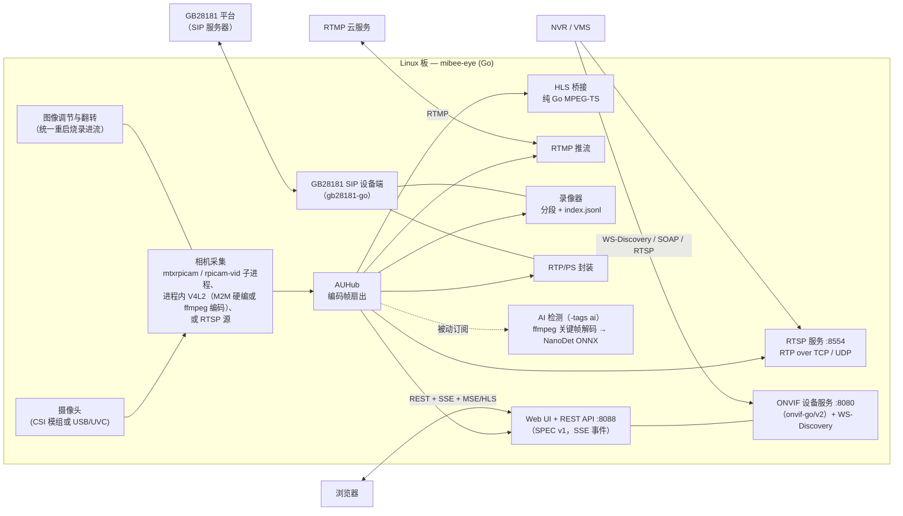
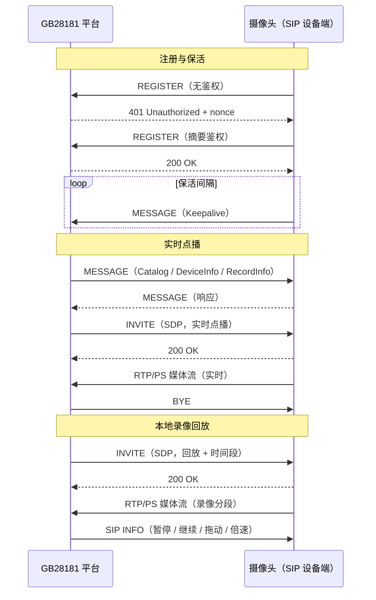

# MiBee Eye（蜂眼）

[](https://github.com/xiqing85/mibee-eye-go/actions/workflows/ci.yml)
[](https://golang.org)
[](LICENSE)

[English](README.md)

<div align="center">
  <table>
    <tr>
      <td align="center"><b>🪶 实测 ~74 MB</b><br><sub>RPi 3B、AI 构建、主进程（见性能表）</sub></td>
      <td align="center"><b>✅ ONVIF Profile S</b><br><sub>设备 · 媒体 · 成像</sub></td>
      <td align="center"><b>🔧 零 CGO</b><br><sub>纯 Go，交叉编译无痛</sub></td>
    </tr>
  </table>
</div>


MiBee Eye 是一个轻量级的 Go ONVIF 相机服务，跑在任意 Linux 板上（树莓派 CSI 经 libcamera，USB/UVC 走 v4l2 模式）。
它也可以跑在任意 Linux 设备上做协议网关：`camera.mode: rtsp` 可把已有 RTSP 流
变成 ONVIF/GB28181 设备 —— 见[支持的硬件](#支持的硬件)。它提供 ONVIF 设备/媒体/成像服务、RTSP 流媒体、RTMP 推流、WS-Discovery、GB28181 国标接入与内嵌 SPEC v1 Web 管理界面，用于 NVR/VMS 集成。

这是 MiBee Eye 的 **Go 实现**。另有一个面向极致受限板子的兄弟 [Rust 实现](https://github.com/xiqing85/mibee-eye-rs)，见[我该选哪个实现？](#我该选哪个实现)。

**任意 Linux 板可跑** —— 三种采集画像：树莓派 CSI 相机走 libcamera
（`mtxrpicam`/`rpicamvid`）；任意 V4L2/USB-UVC 相机走通用 `v4l2` 模式
（`camera.encoder_device` 探测到 M2M 编码器则硬编，否则常驻 ffmpeg 子进程
软编）；`rtsp` 模式把外部 RTSP 流重新发布为 ONVIF/GB28181 设备。

## 我该选哪个实现？

两个实现说同样的协议（ONVIF Profile S、GB28181、RTSP、RTMP）、共享同一套
SPEC v1 Web UI/API、对接同样的 NVR —— 按部署画像选择：

| 选 **Go 实现**，当你… | 选 **Rust 实现**，当你… |
|---|---|
| 想最快跑起来：零 CGO 构建、原生交叉编译 | 板子内存/闪存吃紧（~2 MB 二进制；满配 RSS 见下方实测行） |
| 需要开箱即用的 HLS 浏览器播放 | 需要把 OSD 水印烧录进每一路输出 |
| 需要 i18n 界面或运行指标 API | 要求采集+编码全程进程内（无采集子进程） |
| 更想在 Go 代码上动手 | 更想在 Rust 代码上动手 |

两者共有：AI 检测（NanoDet，可选）· GB 35114 A 级（可选）· 连续录像 + GB28181
回放 · 图像调节 · 快照。

## 功能

- **ONVIF 设备/媒体/成像服务** - 完全符合 ONVIF Profile S，支持 NVR 集成，基于 [onvif-go/v2](https://github.com/mickeyzzc/onvif-go)
- **GB28181 接入** - SIP 注册、Catalog/DeviceInfo/RecordInfo 查询、直播/回放/下载 PS 流（UDP/TCP）、SIP INFO 回放控制（暂停/恢复/拖动/倍速）、平台抓拍指令 —— 基于 [gb28181-go](https://github.com/mickeyzzc/gb28181-go)
- **GB 35114 A 级** - 可选 SM2 证书注册认证 + keyed-SM3 完整性（`-tags gb35114`）
- **RTSP 流媒体** - H.264 视频流（RTP over TCP interleaved 或 UDP），分辨率与码率可配置
- **RTMP 推流** - 推送到阿里云、Twitch、YouTube 等云服务
- **WS-Discovery** - 网络自动发现相机
- **本地录制** - 持续 H.264 分段 + `index.jsonl` 索引，保留天数与容量上限；作为 GB28181 回放源
- **Web 管理界面** - 内嵌 SPEC v1 管理面板：cookie 会话 + CSRF 鉴权、实时预览（MSE/HLS）、配置 API、SSE 事件
- **AI 检测** - 关键帧 NanoDet-Plus ONNX 目标检测（`-tags ai`），见下文 [AI 检测](#ai-检测可选)
- **相机控制** - 亮度、对比度、饱和度、锐度、白平衡、曝光模式；水平/垂直翻转经统一重启流程烧录进流
- **HLS 直播流** - 纯 Go MPEG-TS 分段器，支持 Web 直播流（无 ffmpeg 依赖）
- **国际化支持** - 中英文界面切换 (i18n)
- **快照支持** - 通过 HTTP 端点获取 JPEG 快照
- **运行指标** - 经 Web API 输出运行时指标摘要
- **低内存占用** - 精简配置约 15–25 MB；RPi 3B + AI 构建实测主进程 ~74 MB（rpicam-vid/ffmpeg 采集子进程的开销另计）
- **跨平台构建** - 从 x86 工作站交叉编译到 aarch64 树莓派

## 快速开始

```bash
# 克隆并构建
git clone https://github.com/xiqing85/mibee-eye-go
cd mibee-eye-go
make build

# 复制并配置
cp configs/config.example.yaml config.yaml
# 编辑 config.yaml 配置相机和网络

# 直接运行
./build/mibee-eye -config config.yaml

# 或使用 systemd 部署
sudo cp deploy/mibee-eye.service /etc/systemd/system/
sudo systemctl daemon-reload
sudo systemctl enable --now mibee-eye
```

Linux 预编译产物（amd64 / arm64 / armv7）见
[Releases](https://github.com/xiqing85/mibee-eye-go/releases) 页面。

## 配置

查看 `configs/config.example.yaml` 了解所有配置选项。主要设置包括：

- `camera.mode` - 采集模式：`mtxrpicam`（树莓派 CSI 子进程管道）、`rpicamvid`（系统 rpicam-vid）、`rtsp`（拉取 RTSP 源）或 `v4l2`（通用 V4L2 采集 —— 任意板、含 USB/UVC）
- `camera.encoder_device` - `v4l2` 模式探测的 V4L2 M2M 编码节点（默认 `/dev/video11` 即 bcm2835-codec；缺失或非 M2M 时回退 ffmpeg 子进程）
- `camera.width/height` - 采集分辨率（默认 1280x720）
- `camera.fps` - 每秒帧数（树莓派 3B 默认 15）
- `camera.bitrate` - 视频码率（比特/秒）
- `camera.idr_period` - 关键帧间隔；同时约束 AI 检测节奏
- `camera.hflip` / `camera.vflip` - 翻转烧录进流（经统一重启生效）
- `camera.rotation` - 90° 步进旋转（0/90/180/270，顺时针）烧录进流；90/270 互换对外宣告的分辨率。rpicamvid：0/180 走 libcamera 翻转、90/270 走裸 YUV 子进程 + 进程内转置 + M2M 硬编（树莓派 libcamera 无 transpose 支持，管线绕开）；v4l2：进程内转置；其余模式拒绝非 0 值
- `rtsp.port` - RTSP 流媒体端口（默认 8554）
- `onvif.port` - ONVIF HTTP/SOAP 端口（默认 8080）
- `onvif.username/password` - ONVIF 认证凭据
- `onvif.events_enabled` - Pull-Point 事件服务：AI 运动告警以 MotionAlarm 推送给订阅的 NVR（默认 true）
- `web.enabled` - 启用 Web 管理界面（默认 true）
- `web.port` - Web 界面 HTTP 端口（默认 8088）
- `gb28181.enabled` - 向 SIP 平台注册（默认 false）
- `gb28181.transport` - SIP 传输：`udp` 或 `tcp`（默认 udp）
- `recording.enabled` - 持续本地录制（默认 false）
- `recording.storage_path/segment_secs/retention_days/max_storage_mb` - 录制目录与清理策略（默认：`recordings` / 600 / 3 / 8192）
- `ai.enabled` - NanoDet 检测（默认 false；需 `-tags ai` 构建）
- `metrics.*` - 运行时指标采集

环境变量使用 `MIBEE_EYE_` 前缀覆盖任何配置设置：
```bash
MIBEE_EYE_ONVIF_PASSWORD=secret ./build/mibee-eye
```

## 部署

基于 `deploy/mibee-eye.service` 创建 systemd 服务单元。根据你的环境自定义：

```bash
# 安装和配置
sudo cp deploy/mibee-eye.service /etc/systemd/system/
# 为你的设置编辑路径和用户
sudo systemctl daemon-reload
sudo systemctl enable --now mibee-eye
```

## Web 管理界面

内置 Web 管理面板遵循 MiBee 各摄像头项目统一的 SPEC v1 API：JSON 信封
`{"ok":true,"data":…}` / `{"ok":false,"error","message"}`、cookie 会话 +
双提交 CSRF 鉴权、能力协商与 SSE 事件通道。

- **实时预览** - **MSE (Media Source Extensions) 与 HLS (hls.js)** 播放器，浏览器直播灵活可选
- **图像控制** - 亮度、对比度、饱和度、锐度滑块；白平衡与曝光模式下拉框；翻转开关（保存即重启生效）
- **配置 API** - `GET/PUT /api/config`，部分合并语义（未涉及的节保持不变）
- **相机与检测** - `GET /api/cameras`、`GET /api/detections`（AI 构建）、SSE `GET /api/events`
- **运行指标** - `GET /api/metrics/summary`
- **快照按钮** - 一键获取相机 JPEG 快照（`GET /snapshot`）

通过 `http://<设备IP>:8088/` 访问，Web 凭证缺省沿用 ONVIF 凭据。
Web 界面通过 `//go:embed` 嵌入到二进制文件中，无需额外文件部署。

## 支持的硬件

三种采集画像覆盖树莓派 CSI 模组、通用 V4L2 设备与既有 IP 相机：

| 采集模式 | 适用平台 | 编码 |
|---------|---------|------|
| `mtxrpicam` / `rpicamvid` | 树莓派家族（CSI 模组） | libcamera 前端输出 H.264（子进程内） |
| `v4l2` | 任意 Linux 板 —— 含 USB/UVC | 探测 `camera.encoder_device` 命中则进程内 V4L2 M2M 硬件编码，否则常驻 ffmpeg 子进程 |
| `rtsp` | 任意主机（已有 IP 相机） | 转发源流（不转码） |

### 树莓派 CSI 摄像头模组

| 模组 | 传感器 | 分辨率 | 对焦 | DT Overlay | 说明 |
|------|--------|--------|------|------------|------|
| Pi Camera V1 | OV5647 | 2592×1944 | 固定焦 | `ov5647` | 当前配置 |
| Pi Camera V2 | IMX219 | 3280×2464 | 固定焦 | `imx219` | 更好的低光性能 |
| Pi Camera V3 | IMX708 | 4608×2592 | 自动对焦 | `imx708` | PDAF，HDR 支持 |
| Pi HQ Camera | IMX477 | 4056×3040 | 手动镜头 | `imx477` | 可更换镜头 |
| USB (UVC) | 各类 | 各类 | 固定焦 | `uvcvideo` | `camera.mode: v4l2` 直接采集（任意板）；软编兜底需设备装有 ffmpeg |

## 架构



树莓派上，采集使用久经考验的 libcamera 前端（`mtxrpicam` 子进程管道或系统
`rpicam-vid`），服务本体保持纯 Go、零 CGO。通用 `v4l2` 模式进程内采集
（纯 Go V4L2：探测到 M2M 节点走硬编，否则常驻 ffmpeg 子进程软编）；
`rtsp` 模式转发外部流、不转码。所有订阅方共享同一编码帧枢纽
（AUHub）—— 包括 AI 检测器：它被动订阅，绝不干扰采集与推流路径。
ONVIF/GB28181 协议逻辑位于独立协议库
[onvif-go/v2](https://github.com/mickeyzzc/onvif-go) 与
[gb28181-go](https://github.com/mickeyzzc/gb28181-go)。

### GB28181 交互总览



### vs 在树莓派上用 MediaMTX 当相机源

MediaMTX 是优秀的媒体*服务器*（NVR/中继侧）—— 它本身也是纯 Go、零 CGO 项目。
下表只比较**相机侧**角色：把“树莓派 + CSI 摄像头”变成可被 NVR 发现并拉流的
ONVIF/GB28181 设备。

| 相机侧能力 | MiBee Eye | MediaMTX |
|------------|-----------|----------|
| ONVIF 设备服务（Profile S） | ✅ 设备/媒体/成像 | ❌（非其定位） |
| GB28181 设备端 | ✅ | ❌ |
| 相机图像调节 | ✅ 亮度/对比度/白平衡等 | ❌ |
| RTMP 推流 | ✅ 内置 | ⚠️ 可实现，媒体服务器风格 |
| 内存（RPi 3B，720p@15fps） | **实测 ~74 MB**（AI 构建，主进程） | **实测 ~93 MB**（满配） |

2026-09-17 用 [`bench/rpi-bench.sh`](bench/rpi-bench.sh) 实测：Go 侧于
`rpi3b-cam`（RPi 3B、IMX219 1280×720@15、AI 构建、`rpicamvid` 采集、
GB28181 已注册、1 路 RTSP/TCP 拉流、60 秒）：RSS 71–79 MB（均值 74）、
CPU 179–278% —— 仅主进程，rpicam-vid/ffmpeg 采集子进程开销另计；精简
非 AI 配置要低得多。Rust 兄弟实现于 `rpi3b-storage`（RPi 3B、OV5647、
满配、进程内管线）：RSS ~93 MB、CPU ~1.4 核——详见其 README。可在自己
的板子上复测。

### 技术栈

| 组件 | 库 | 理由 |
|------|-----|------|
| ONVIF 服务 | [onvif-go/v2](https://github.com/mickeyzzc/onvif-go) | 独立协议库，纯 Go |
| GB28181 设备端 | [gb28181-go/device](https://github.com/mickeyzzc/gb28181-go) | 独立协议库，纯 Go |
| RTSP 服务 | `bluenviron/gortsplib/v5` | 与 MediaMTX 同源，兼容性久经考验 |
| RTMP 推流 | 纯 Go 实现 | 维护活跃，占用低 |
| 相机采集 | `mtxrpicam` / `rpicam-vid` 子进程，或进程内 V4L2 | Pi 上久经考验的 libcamera；其余平台纯 Go V4L2（M2M 硬编 + ffmpeg 兜底） |
| HLS 桥接 | 纯 Go MPEG-TS 分段器 | 无外部依赖，轻量 |
| AI 检测 | `onnxruntime_go` + ffmpeg 关键帧解码 | ONNX 运行库动态加载，按关键帧节奏检测 |
| Web 界面 | 内嵌零构建 ES Modules UI + hls.js | 能力门控渲染，无外部依赖 |
| 配置 | YAML | 可读性好，部署简单 |

默认构建为纯 Go —— **零 CGO**。所有协议（ONVIF、GB28181、RTSP、RTMP、HLS、
快照）均为纯 Go 实现；唯一例外是可选的 AI 构建标签，需 CGO 链接 ONNX Runtime。

## AI 检测（可选）

使用 `-tags ai` 构建以启用关键帧 NanoDet-Plus 目标检测：

```bash
# 交叉编译 AI 版（CGO：需 aarch64 交叉 gcc，如 Arm GNU Toolchain）
CGO_ENABLED=1 CC=aarch64-none-linux-gnu-gcc GOOS=linux GOARCH=arm64 \
  go build -tags ai -o build/mibee-eye-ai ./cmd/server
```

运行时检测器经 `ffmpeg` 子进程把 H.264 关键帧解码为 RGB，用 ONNX Runtime
跑内置 NanoDet-Plus-m 320 模型，结果经 `GET /api/detections` 与
`ai_detection` SSE 事件输出。实际检测节奏由 `ai.interval_ms` 与相机关键帧间隔
（`camera.idr_period`）共同约束。模型或运行库缺失时 fail-open 降级为
`ai:false`，绝无假数据。

## 开发

```bash
# 工作站构建
make build

# 交叉编译 aarch64 SBC
make build GOOS=linux GOARCH=arm64

# 运行测试
make test

# 部署到远程
make deploy REMOTE_HOST=user@your-rpi-host
```

## 许可证

以 **Apache License, Version 2.0** 授权 —— 详见 [LICENSE](LICENSE)。
MediaMTX 衍生部分（internal/camera）沿用 MIT，见 [NOTICE](NOTICE)。

> 许可历史：v0.1.0 曾以 CC BY-NC 4.0 发布；2026-09-13 起项目改为
> Apache-2.0（唯一版权持有人变更）。
